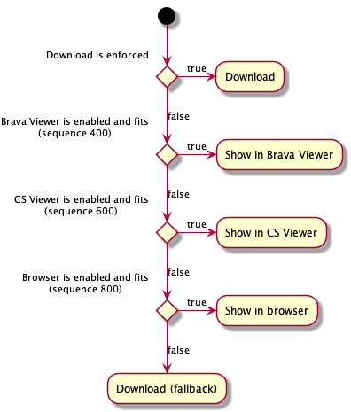

# Local Open Document Command Delegates


## Commands

The following commands are owned by this module and included in the list
of document opening delegates to be evaluated in this order:

* [`OpenSpecificNodePerspective`] if enforced over opening the content
* [`OpenDocumentContent`] if content viewing is not forbidden

Rules for other commands can be added by other modules.

If no command can be chosen using the command preferences and document attributes, the perspective-opening command will be executed. (If the node is openable, which is the condition to enable document opening, some command has to be executed to prevent a failure. The perspective can be always opened if the node isd openable.)

## Configuration

The following boolean flags can be passed to this module inside the `config` object with `require.config` to set global command preferences:

* `allowPerspective`: Enforce navigation to the document perspective instead of opening the document content. The default is `false`.
* `allowViewContent`: View the document content using the best-fitting content plugin. The default is `true`. This can be used to forbid viewing the document content globally and enforce only its download.

### Example

Prefer navigating to the document perspective. (Opening the content will never take place, because the document perspective is always available.)

```js
require.config({
  config: {
    'csui/utils/commands/open.document/csui.open.document.delegates': {
      allowPerspective: true
    }
  }
});
```

## OpenDocumentContent Command

The `Open` command is implemented using *open content plugins* that provide the following functionality by default:



[`OpenSpecificNodePerspective`]: ../open.specific.node.perspective.md#openspecificnodeperspective-command
[`OpenDocumentContent`]: #opendocumentcontent-command
