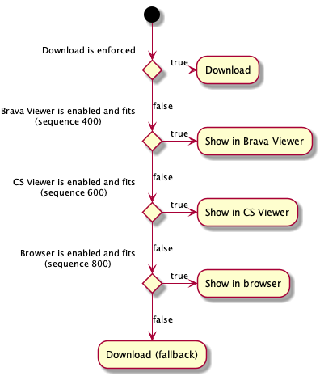

# Open Command

Opens the *content of a document*. Accepts object types with content. Automatically resolves shortcuts and generations to their target document or version. Chooses an *open content plugin* with the best implementation in the command context.

The core module (`csui/utils/commands/open.plugins/impl/core.open.plugins`) includes plugins for the following operations:



## Example

```js
var document = new NodeModel({ id: 123, type: 144, openable: true }, { connector });
var options = { nodes: new Backbone.Collection([ document ]) };
var openContent = commands.get('Open');
if (openContent.enabled(options)) {
   openContent
     .execute(options)
     .then(undefined, function (error) { ... });
}
```
