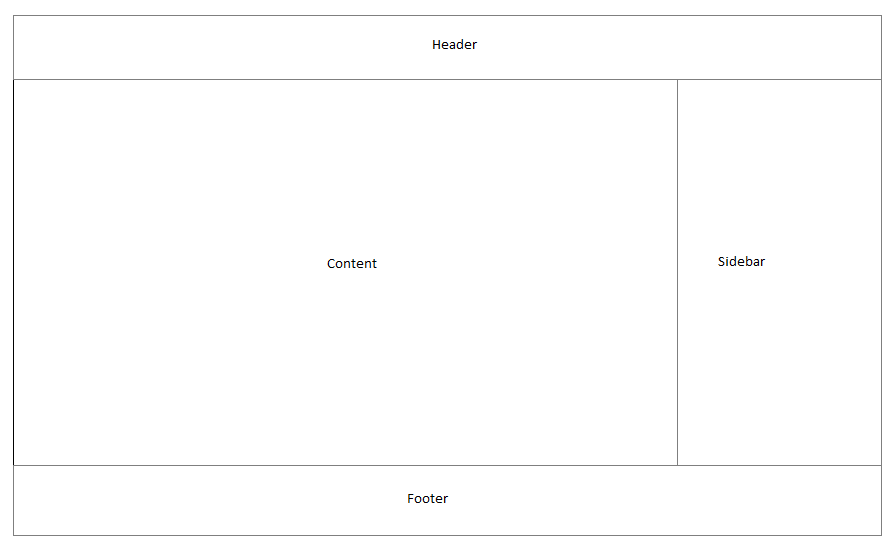

Content Server Workflow
=======================

## Description
Content Server Workflow is a core component of Content Server. It provides workflow functionality for the Content Server.

The functionality is split into different parts:

* Workflow Designer
* Workflow Status
* Workflow Assignment

### Workflow Designer
The Workflow Designer is the graphical design tool to create workflows. Depending on the permissions 
a user can create new or modify existing workflows. The workflows are stored in Workflow 
Map nodes in Content Server folders. 
The Workflow Designer is running in the Content Server Classic UI.

### Workflow Status
Workflow Status is a status view for a running or completed workflow. 
It is accessible via the Workflow Status list in the Classic UI.

### Workflow Assignment
Workflow Assignments are active workflows which are assigned to a user.
Workflow Assignments can be accessed via the My Assignments list / widget in the Classic UI and in the Smart View.
A click on an assignment opens the workflow user interface in the Classic UI or in the Smart View, 
depending on the workflow step configuration. This configuration is done for each User / Initiator Step in the workflow design.

## Workflow Smart View
Content Server Workflow supports currently the Start, User and Initiator step interface as a Smart View widget.
All other workflow components are only accessible in the Classic UI.

The workflow widget is divided into different areas.
 
 
 
* Header  
  The header area contains the workflow title
* Footer 
  The footer area contains the buttons with the possible workflow actions, like `Send On`, `Forward`, `Send for review`, `Close`  and the custom 
  dispositions
* Sidebar 
  The sidebar contains the data from the supported data packages. Data packages are workflow extensions like `Attributes`, `Attachments`, 
  `Comments` or custom extensions. Currently only `Attachments` are supported in the Smart View.
* Content 
  The content area is the main area in the workflow widget. In this area the Smart View form is displayed,
  which is defined in the Workflow Designer. This form gives the user access to the workflow attributes and some standard fields.

## Workflow URL routes
The workflows in the Smart View are accessible via dedicated URLs.

For running workflows the following URL is defined: 
  `.../processes/<process_id>/<subprocess_id>/<task_id>`

For workflows in the initiation phase the following URL is defined: 
  `.../draftprocesses/<draftprocess_id>`
  
The differentiation is necessary, because a workflow in the initiation phase behaves differently as a running workflow.

These URLs are also used in the email notifications for workflows which are configured for the Smart View.

## Workitem model
The main interaction point between Smart View and Content Server Workflow is the workitem model.
The workitem model is a representation of the workflow data in the Smart View and it contains
the methods to communicate with the server.

The workitem model could be found here: [Workitem model](./models/workitem/workitem.model.md)

## Extension points
> Only the documented extension points are available for customizations.
> All other parts of the workflow Smart View interface can change in the future!

Content Server Workflow itself provides basic functions to work with data and content.
To provide more functionality workflow has different extension points on the Oscript side.
These extension points are heavily used to extend workflow, for example with new step types and data packages.

On the Smart View side workflow provides an interface which data packages can use to extend the interface.

> For the current release only the extension point to show a view inside the content area below the defined forms is supported.
> More will come in future releases.

How an extension is implemented is described here: [workitem.extensions.controller](./utils/workitem.extension.controller.md)
